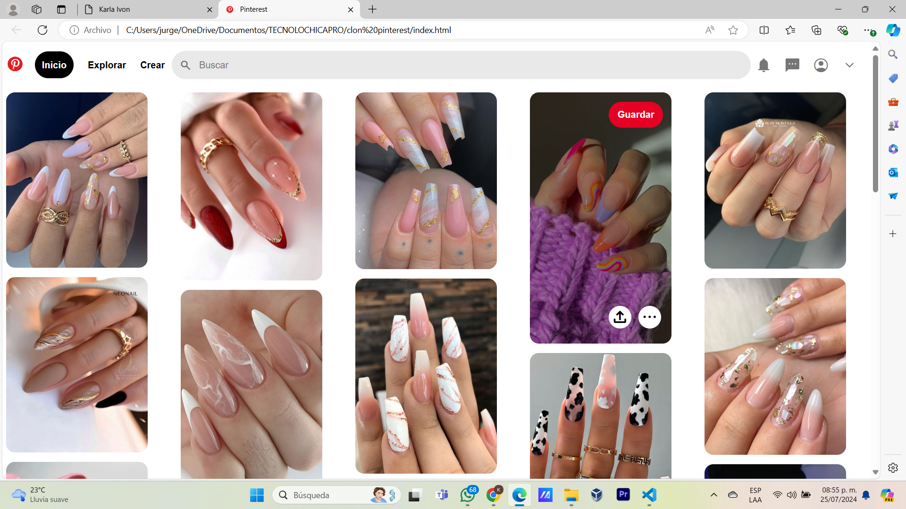

# Clon de Pinterest de Karla Ivon
## Proyecto responsivo realizado con Bootstrap 5

Proyecto creado durante el bootcamp de Tecnolochicas PRO, es adaptable a distintos dispositivos o tamañaos de pantalla.

El propósito de esta pagina web es mostrar mi clon de pinterest de proyectos como desarrolladora web.💜 <3

Podrás encontrarlo aquí[clonpinterest](https://github.com/KarlaIvon15/pinterest-done)

### Tecnologías
* HTML
* CSS
* Bootstrap 5
* JAVASCRIPT

### El proyecto cuenta con las siguientes secciones:

* Inicio
* Explorar
* Crear
* Buscar
* Guardar
### Captura del proyecto

